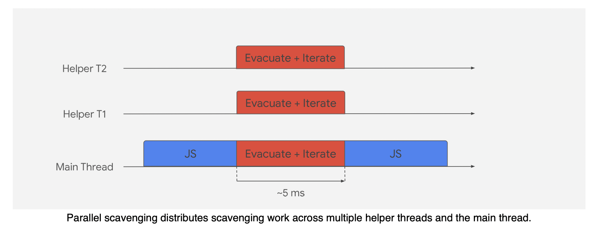

## Garbage collection
Garbage collection은 다음과 같은 형태로 발전해 왔습니다.

### Reference-counting garbage collection
단순한 알고리즘 방식으로 객체의 참조 횟수를 counting하여 0이 되면 메모리에서 release시키는 방식입니다.  
하지만 해당 알고리즘은 순환참조(circular references)에 취약합니다.  
서로가 서로를 참조해버리면 메모리에서 release가 안되며 이는 메모리 누수(Memory leak)이 발생되는 원인이 됩니다.  
Internet Explorer 6 and 7에는 이러한 알고리즘 방식이 사용되어 Memory leaks가 발행한다고 알려져있습니다.  
최신 Garbage collection에는 해당 알고리즘을 사용하고 있지 않습니다.

### Mark-and-sweep algorithm
가장 많이사용되는 알고리즘으로 tree구조를 갖고 있습니다.  
Root라는 객체를 하나 생성한 후 Heap에 할당된 객체들을 참조하게 됩니다.  

때문에 각자 순환참조가 이뤄져도 Root와 연결이 끊겨있다면 지워버립니다.  

## V8 Engine garbage collection
V8 Engine에는 2개의 영역이 있습니다.
- New space(Young generation) : 새로 만들어진 Object가 저장된다.
- Old space(Old generation) : New sapce에서 2번이상 garbage collection이 정리할 동안 살아남은 object들이 저장된다.

V8 Engine의 GC에는 Minor GC와 Major GC가 있습니다.  
Minor GC는 New space에서 동작하고, Major GC는 Old space에서 동작합니다.  

### Minor GC(Scavenger)

https://speakerdeck.com/deepu105/v8-minor-gc?slide=2

New space에는 2개의 semi영역이 있습니다. (JVM의 s0 s1)  
그리고 New space는 기본적으로 메모리 할당이 작게 됩니다. (1MB ~ 8MB)  
때문에 메모리가 금방차고 금방 정리됩니다. 
2개의 semi영역은 From과 To영역으로 불리며, 두개의 영역이 번갈아 가면서 그 역할을 합니다.  
(슬라이드에서 동작 설명...)

이러한 이동과정을 Cheney의 알고리즘이라고 하며, stop and copy와 tracing garbage collection라고 합니다.
그리고 V8에서는 이를 Scavenger라고 부릅니다.
https://v8.dev/blog/orinoco-parallel-scavenger#single-threaded-cheney%E2%80%99s-semispace-copy

지금 V8에서는 Parallel Scavenge방식을 사용하고 있습니다.
이는 기존에 단일 스레드 방식에서 멀티 스레드 방식으로 변경하여 stop the world 시간을 많이 줄였다고 합니다.  
그리고 각 작업은 interleaved하게 진행되어서 빠르다고 합니다. https://ko.wikipedia.org/wiki/%EB%A9%94%EB%AA%A8%EB%A6%AC_%EC%9D%B8%ED%84%B0%EB%A6%AC%EB%B9%99

https://v8.dev/blog/trash-talk#scavenging

### Major GC

Major GC는 Old space에 있는 객체들을 정리하는 GC입니다.  
여기에는 Mark-Sweep-Compact 알고리즘과 Tri-color 알고리즘을 사용합니다.  
V8 Engine에서 Mark-Sweep-Compact는 다음과 같이 동작합니다.  

#### Marking
DFS로 순회하면서 Tri-color(white, gray, black)로 마킹합니다.
V8은 객체당 두 개의 마크 비트와 마킹 작업 목록을 사용하여 마킹을 구현합니다.  
2개의 마크 비트는 흰색(00), 회색(10) 및 검은색(11)의 세 가지 색상을 인코딩합니다.  
색상별로 다음과 같은 상태를 나타냅니다.
- white: GC가 아직 탐색하지 못한 상태.
- gray: GC가 white 객체를 탐색하고 작업목록에 푸쉬한 상태.
- black: 해당 객체가 참조하고 있는 객체까지 확인을 한 상태. 
이 체계를 삼색 마킹이라고 합니다.  
더 이상 회색 개체가 없으면 마킹이 완료됩니다.  
나머지 흰색 개체는 모두 연결할 수 없으며 안전하게 회수할 수 있습니다.  

#### Sweep
Sweep은 지워진 개체가 남긴 메모리 간격을 사용 가능한 목록이라는 데이터 구조에 추가하는 프로세스입니다.  
즉, 흰색으로 마킹된 객체들을 말하며, free-list라고 부르는 자료구조에 넣습니다.  (https://ko.wikipedia.org/wiki/%EB%B9%88%EC%B9%B8_%EB%AA%A9%EB%A1%9D)

#### Compact 
Compact는 압축하는 단계입니다. Sweep과정에서 free-list에 들어간 여유 공간들이 조각화 되어 있는데,  
이를 휴리스틱 기반으로 일부 페이지를 비우거나 압축하도록 선택합니다.(휴리스틱은 어림짐작이라는 뜻입니다.)  
압축은 PC의 하드 디스크 조각 모음과 비슷하다고 생각할 수 있습니다.  
남아 있는 개체를 현재 압축되지 않은 다른 페이지에 복사합니다.(해당 페이지의 여유 목록 사용).  

이렇게 했을 때의 단점은 수명이 긴 객체가 많아질 때 복사비용이 높다는 점입니다.  
때문에 모든 페이지에 대해서 압축을 진행하는 것이 아니라 일부 페이지만 압축을 진행합니다.  
그래서 Sweep을 자주 활용하고, 여기에 있는 여유공간에 객체를 넣는다고 합니다.

https://v8.dev/blog/trash-talk#major-gc

완료된 후 모습 이런식으로 됩니다.

Major GC도 V8 engine에서는 Parallel하게 만들어져 사용되고 있습니다.  

이는 GC의 문제점인 stop the world를 최소한으로 줄이려고 사용합니다. 
이러한 방식을 동시마킹이라고 합니다. 동시마킹이 완료되면 여러 도우미와 함께 병렬 압축 및 포인터 업데이트를 시작합니다.  
main 스레드는 일시 중지 중에 동시 스위핑 작업을 시작합니다.  
이는 병렬 압축 작업과 main 스레드 자체에 동시에 실행되며 JavaScript가 main 스레드에서 실행 중일 때도 계속될 수 있습니다.
